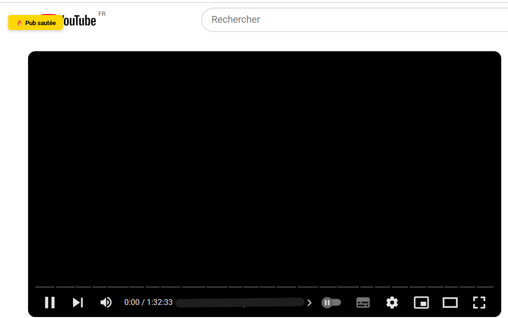

# YouTube AdBlock Extension

Chrome extension to block ads on YouTube.

[](https://github.com/AntoineBendafiSchulmann/yt_adblock/blob/main/LICENSE)

<div align="center">
    
</div>

[ [🇫🇷 Français](README_FR.md) | [🇬🇧 English](README.md) ]

### 🚀 Features

- Blocking requests to advertising domains via `declarativeNetRequest`
- Automatic skipping of non-skippable ads
- Automatic click on "Skip Ad" buttons
- Removal of interface elements related to ads
- User feedback via toast notifications (e.g. "⏩ Skip button clicked", "🔥 Ad skipped")

### 📦 Manual installation

1. Clone the repo or download the ZIP
2. Go to `chrome://extensions`
3. Enable **Developer mode**
4. Click **Load unpacked**
5. Select the project folder

### 📁 Project structure

```
 yt_adblock/
 ├── icons/
 │   └── icon.png
 ├── background.js
 ├── content.js
 ├── manifest.json
 ├── popup.html
 ├── popup.js
 ├── rules.json
 └── README_FR.md / README.md
```

### 🔧 Technologies used

- Manifest V3 (Chrome Extensions)
- `MutationObserver`, `setInterval`, and `chrome.storage` to detect ads and enable/disable blocking
- `declarativeNetRequest` to block requests to advertising domains (e.g. `doubleclick.net`, `pagead/`, etc.)

### 📝 Documentation

- [Manifest V3 Overview](https://developer.chrome.com/docs/extensions/mv3/intro/)
- [Manifest V3](https://developer.chrome.com/docs/extensions/reference/api?hl=en)
- [Block or modify network requests with `declarativeNetRequest`](https://developer.chrome.com/docs/extensions/reference/api/declarativeNetRequest?hl=en)

### ❗ Known limitations

- A slight black screen may appear between the ad and the video. This is a YouTube behavior and can only be eliminated server-side
- The extension does not block ads on websites other than YouTube.



### 📝 License

[MIT](https://github.com/AntoineBendafiSchulmann/yt_adblock/blob/main/LICENSE)

### 👤 Author

[Antoine Bendafi-Schulmann](https://github.com/AntoineBendafiSchulmann)
