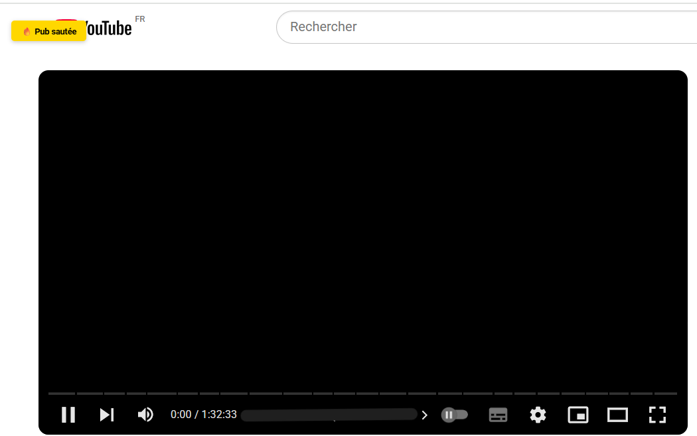

# YouTube AdBlock Extension

Extension Chrome pour bloquer les publicités sur YouTube.

[](https://github.com/AntoineBendafiSchulmann/yt_adblock/blob/main/LICENSE)

<div align="center">
    
</div>

[ [🇫🇷 Français](README_FR.md) | [🇬🇧 English](README.md) ]

### 🚀 Fonctionnalités

- Blocage des requêtes aux domaines publicitaires via `declarativeNetRequest`
- Saut automatique des pubs non skippables
- Clic automatique sur les boutons "Ignorer"
- Suppression des éléments d’interface liés aux pubs
- Feedback utilisateur via toasts visuels (ex : "⏩ Bouton Ignorer cliqué", "🔥 Pub sautée")

### 📦 Installation manuelle

1. Clone le repo ou télécharge le ZIP
2. Aller dans `chrome://extensions`
3. Activer le **mode développeur**
4. Cliquer sur **Charger l’extension non empaquetée**
5. Sélectionne le dossier du projet

### 📁 Structure du projet

```
 yt_adblock/
 ├── icons/
 │   └── icon.png
 ├── background.js
 ├── content.js
 ├── manifest.json
 ├── popup.html
 ├── popup.js
 ├── rules.json
 └── README_FR.md / README.md
```

### 🔧 Technologies utilisées

- Manifest V3 (Chrome Extensions)
- `MutationObserver`, `setInterval` et `chrome.storage` pour détecter les publicités et activer/désactiver le blocage
- `declarativeNetRequest` pour bloquer requêtes aux domaines publicitaires (ex : `doubleclick.net`, `pagead/`, etc)

### 📝 Documentations

- [Vue d’ensemble Manifest V3](https://developer.chrome.com/docs/extensions/mv3/intro/)
- [Manifest V3](https://developer.chrome.com/docs/extensions/reference/api?hl=fr)
- [Bloquer ou modifier les requêtes réseau avec `declarativeNetRequest`](https://developer.chrome.com/docs/extensions/reference/api/declarativeNetRequest?hl=fr)

### ❗ Limites connues

- Un léger écran noir peut apparaître entre la pub et la vidéo. Il s’agit d’un comportement de YouTube et ne peut être éliminé que côté serveur.
- L’extension ne bloque pas les publicités sur d’autres sites que YouTube.



### 📝 Licence

[MIT](https://github.com/AntoineBendafiSchulmann/yt_adblock/blob/main/LICENSE)

### 👤 Auteur

[Antoine Bendafi-Schulmann](https://github.com/AntoineBendafiSchulmann)
